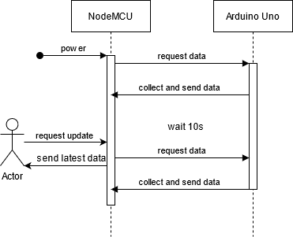
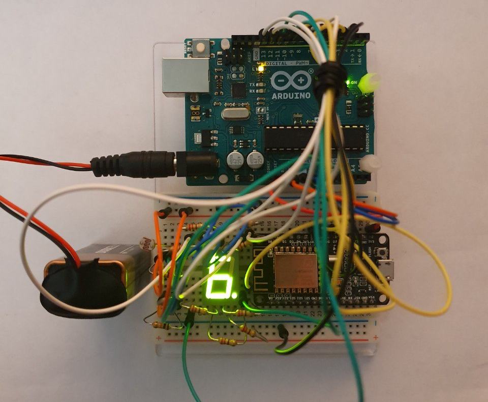
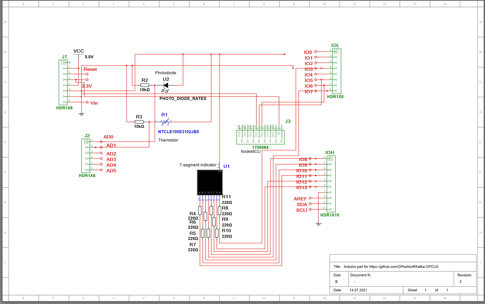
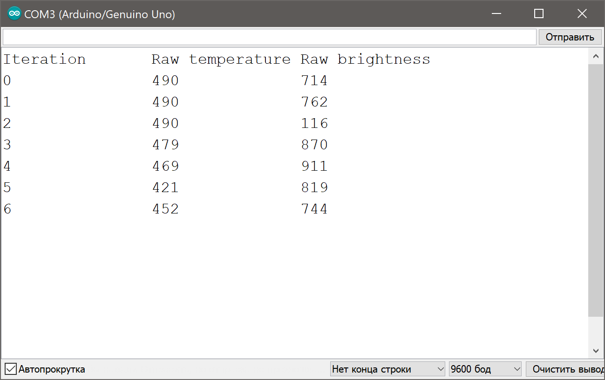
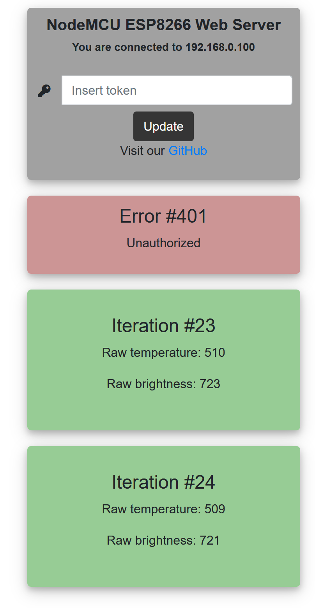
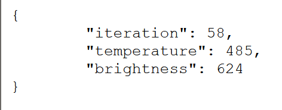
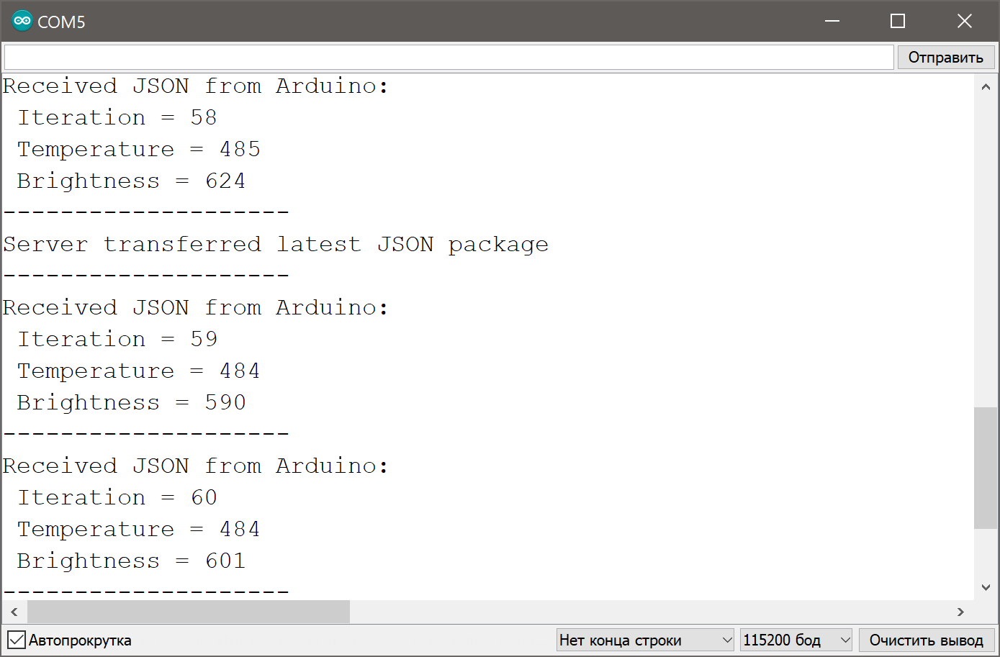

# Arduino Module
Arduino module consists of Arduino Uno and NodeMCU ESP8266 module.

NodeMCU ESP8266 module leads (master). Each 10s it requests update to Arduino and saves it. If NodeMCU asynchronized web server receives "/update" request, it answers with the latest data package. 

Web server is up on port 80. Link speed between Uno and debug USB is 9600 bauds; between NodeMCU and debug USB is 115200 bauds; between Uno and NodeMCU is 4800 bauds.

Meanwhile, Arduino every 10s collects raw data from thermistor and photoresistor. Time of collection is displayed on a seven-segment indicator in the center of the board. 

The sensors are located on the left sife of the board.



Overview of the board:



Multisim design (png version of ```./multisim/arduino.ms14```):



### Arduino Uno

Used libraries:

* [ArduinoJson](https://arduinojson.org/);
* SoftwareSerial.

Debugging messages of Arduino Uno:



### NodeMCU

Used libraries:

* [ArduinoJson](https://arduinojson.org/);
* [ESP8266WiFi](https://github.com/ekstrand/ESP8266wifi);
* [ESPAsyncTCP](https://github.com/me-no-dev/ESPAsyncTCP);
* [ESPAsyncWebServer](https://github.com/me-no-dev/ESPAsyncWebServer);
* SoftwareSerial.

Root webpage:



Response in web browser:



Debugging messages of NodeMCU:



## Project structure
### Folders

```bash
01-arduino
|--multisim
|  |-arduino.ms14 #Multisim Design for the whole device. Use Multisim 14 to open
|
|--screenshots
|
|--src
|  |-01-detector #Arduino Uno code
|  |  |-detector.ino
|  |-02-nodemcu #NodeMCU ESP8266 code
|  |  |-nodemcu.ino
|
|-.clang-format
|
|-README.md
```

### Code style

Code style is based on [Google C++ style guide](https://google.github.io/styleguide/cppguide.html) with several changes:

* IndentWidth: 4;
* AllowShortBlocksOnASingleLine: Empty;
* AllowShortLoopsOnASingleLine: false;
* AllowShortFunctionsOnASingleLine: Empty;
* AllowShortIfStatementsOnASingleLine: Never.