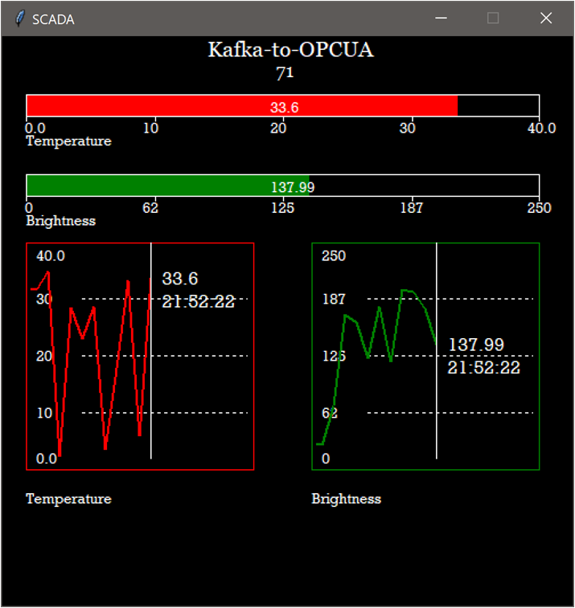

# SCADA-Tkinter Module
SCADA-Tkinter module consists of Dockefile and Kafka config files. It serves as a visualization tool and supports both Windows and Linux usage.

## Used libraries

* OPCUA;
* tkinter.

## Screenshots

Screenshot of interface:



## Project structure
### Folders

```bash
06-scada-tkinter
|-scada.py
|
|-Dockerfile
|
|-README.md
```